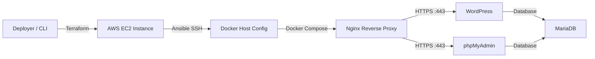

# 🚀 CloudForge — Automated AWS DevOps Infrastructure

> An automated DevOps pipeline combining IaC and configuration management to deploy a secure, reproducible web stack (WordPress + phpMyAdmin + Nginx) on AWS using Terraform, Ansible, and Docker.

---

## 💡 Why This Project?

CloudForge demonstrates a reproducible deployment pipeline where infrastructure provisioning, host configuration, application deployment, and network security are handled as distinct, decoupled layers:

* **Terraform** $\rightarrow$ **Provisioning** (AWS EC2, Security Groups, SSH Keys)
* **Ansible** $\rightarrow$ **Configuration** (Host Hardening, System Dependencies & Secrets)
* **Docker Compose** $\rightarrow$ **Runtime** (Containerized Application Isolation)
* **Nginx** $\rightarrow$ **Edge** (TLS Termination & Reverse Proxy)

---

## 📌 Overview

CloudForge replaces manual, error-prone server setups with an end-to-end automated pipeline. By providing AWS credentials and launching a single command, the project provisions cloud infrastructure, enforces host-level security configurations, generates the required TLS certificates, and spins up an isolated, containerized application environment on a fresh Ubuntu instance.

```text
Deploy Command ➔ Terraform (AWS) ➔ Ansible (Host) ➔ Docker Compose (Stack) ➔ Nginx (TLS/Proxy)
```

---

## 🏗️ Architecture

```text
                         AWS Cloud
                             │
                      ┌──────▼──────┐
                      │ EC2 Instance│
                      │             │
                      │    Nginx    │  ← Edge / Reverse Proxy :443
                      │      │      │
                      │  ┌───┴───┐  │
                      │  │       │  │
                      │  ▼       ▼  │
                      │  WP     PMA │  ← Application Containers
                      │   │       │ │
                      │   └───┬───┘ │
                      │       ▼     │
                      │    MariaDB  │  ← Database + Volume
                      └─────────────┘
```

### Deployment Flow



### Layer Responsibilities

* **Provisioning Layer (Terraform):** Defines and provisions compute and network resources on AWS declaratively.
* **Configuration Layer (Ansible):** Prepares the target host, manages secrets, creates system directories, and configures TLS.
* **Runtime Layer (Docker Compose):** Runs application services in isolated containers connected via private bridge networks.
* **Edge Layer (Nginx):** Handles TLS termination, routes traffic based on server names, and enforces HTTP security policies.

---

## ✨ Key Features

* **Infrastructure as Code (IaC):** Automated provisioning of EC2 instances, Security Groups, SSH key pairs, and public IP allocation using Terraform 1.5+.
* **Secrets Management:** Environment variables and database credentials encrypted using Ansible Vault with strict `0600` file permissions.
* **TLS & Reverse Proxy:** Automated self-signed TLS certificate generation with Subject Alternative Names (SAN), mandatory HTTP-to-HTTPS (301) redirection, security headers (`X-Frame-Options`, `X-Content-Type-Options`), and a `64M` upload limit in Nginx.
* **Container Isolation & Persistence:** Multi-container environment separated via Docker internal networking, utilizing persistent Docker volumes for MariaDB and WordPress data.

---

## 🚀 Quick Start & Usage

```bash
# Clone repository
git clone https://github.com/your-username/cloudforge.git
cd cloudforge

# Grant execution permissions
chmod +x deploy.sh destroy.sh

# Deploy full stack and infrastructure on AWS
./deploy.sh

# Teardown all AWS resources cleanly
./destroy.sh
```

---

## 🗺️ Roadmap

* [x] Terraform provisioning and Ansible automation
* [x] Dynamic self-signed TLS certificate generation and Nginx Reverse Proxy
* [x] One-command orchestration (`deploy.sh` / `destroy.sh`)
* [ ] **Remote Backend:** Migration of Terraform state to an Amazon S3 remote backend with state locking
* [ ] **Public TLS:** Automated domain validation and certificate renewal via Let's Encrypt / Certbot
* [ ] **Observability:** Integration of metric exporters and monitoring stack (Prometheus & Grafana)

---

## 📄 License

MIT
